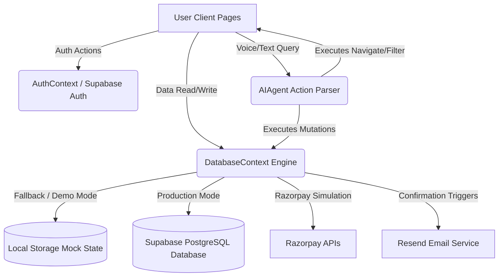

# System Architecture: CricketHub Pro

CricketHub Pro is designed as a modular, scalable sports-tech SaaS platform. This document explains the integration layers, data routing, security schema, and real-time state synchronization.

## System Topology

## Modular Layers

### 1. Database Layer (`supabase/migrations/`)
- Relational schema of 18 tables under PostgreSQL.
- Row-Level Security (RLS) configured to prevent cross-profile updates.
- Automated triggers (`handle_new_user`) that sync authentication accounts directly into player profile records and create base career statistics.

### 2. Frontend Client (`frontend/`)
- **Next.js 15 App Router** for speed, search optimization, and static layout wraps.
- **GSAP & Three.js** for the cinematic stadium intro sequence.
- **Framer Motion** for glassmorphism dropdown transitions, sliders, and navigation panels.
- **Recharts** for premium, fully responsive business revenue and participation metrics dashboard displays.

### 3. Context State Management (`src/contexts/`)
- **DatabaseContext:** Centralizes active database state. Synchronizes user-registered roster profiles, tournament lists, and scores. Restores state from `localStorage` if Supabase details are absent, ensuring immediate, out-of-the-box previewing.
- **AuthContext:** Tracks logged-in users, role assignments (`admin` vs `player`), and manages quick-login options.
- **NotificationContext:** Manages dynamic alert card overlays.

### 4. AI Parsing Agent (`src/components/AIAgent.tsx`)
- Leverages **Web Speech API** (`webkitSpeechRecognition`) for capturing voice inputs.
- Parses actions (membership upgrades, tournament lookups, registrations) using a structured rule processor.
- Features a terminal-style visualizer showing the parsing steps in real-time.
